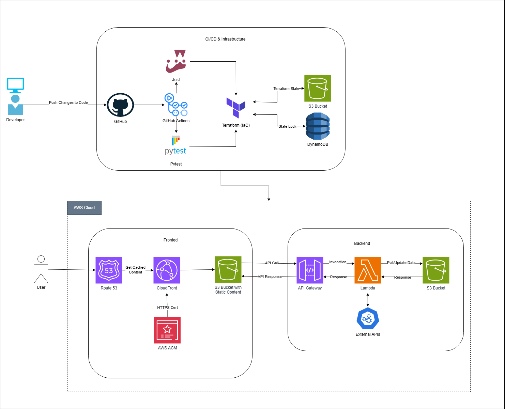

# Stock Market Prediction Website

This website is part of the Cloud Resume Challenge and provides stock market predictions using a machine learning mode I developed for my final year dissertation. It allows users to interact with a frontend that fetches data from external APIs and displays stock market predictions based on historical data.

Please view the website @ stock.chomba-mumba.co.uk

View the frontend repo @ https://github.com/Chomba-Mumba/stock-market-site-frontend

## Architecture Overview

The website is built using a serverless architecture on AWS, including the following key components:

- **Frontend**: The frontend is hosted in an S3 bucket with static content, served over HTTPS via CloudFront. Route 53 is used for DNS routing, and AWS ACM handles the SSL/TLS certification.
- **Backend**: The backend consists of AWS Lambda functions that interact with external APIs to retrieve stock market data. API Gateway serves as an endpoint for the frontend to invoke the backend services. S3 buckets are used for storing the predicted stock data.
- **CI/CD & Infrastructure**: The infrastructure is managed using Terraform, with state stored in an S3 bucket and locked with DynamoDB. CI/CD is handled by GitHub Actions, ensuring that changes to the codebase automatically trigger tests (using Jest and pytest) and deployment processes.

## Features

- Stock price prediction using LSTM-based machine learning models
- Real-time data retrieval from external stock APIs
- Fully serverless and scalable deployment on AWS
- Secure HTTPS connection and domain routing with Route 53 and ACM
- Cached content distribution using CloudFront

## Tech Stack

- **Frontend**: React (bootstrapped with Create React App)
- **Backend**: AWS Lambda, API Gateway, Python
- **Infrastructure**: Terraform, GitHub Actions, S3, DynamoDB
- **Machine Learning**: Python, TensorFlow/Keras

## Futrue Enhancements

- User authentication using AWS Cognito and facilities to provide individual stock predictions.
- Real time Data streaming using AWS Kinesis.
- Additional Analytics dashboards for seperate stock indeces.